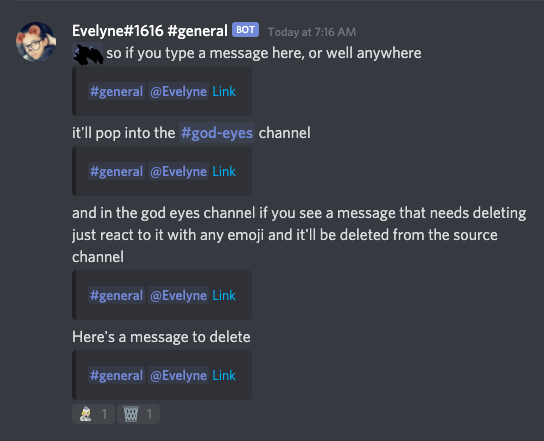

# Discord God Eyes

Discod God Eyes is a simple moderation tool I created for Aggregating all the messages from your server into one channel for easier moderation of multiple channels with mobile moderators in particular in mind.

_(Reacting to a message deletes it from the source channel, the bot replies with the 🗑 emoji to let you know it cleaned up the message.)_

 

---

## Installation

For the easiest setup I recommend using the DigitalOcean deploy button below then following the steps to get the enviroment variables as stated below.

Or if you're more advanced you can build the image yourself or pull the auto-built one from my repo on [Docker Hub](https://hub.docker.com/repository/docker/eeveeboo/discord-god-eyes)

 

---

## Enviroment Variables Setup

To use this app you first need to create a discord bot through the discord developer portal

place the bot token as the DISCORD_TOKEN env variable

Add the bot to your server with permission to see channels, messages and manage messages

next create a "god-eyes" channel or whatever you want to call it. Make sure it's locked behind your moderator role!!

in that "god-eyes" channel open it's settings then click "Integrations" and create a web hook

place web hook url as the WEBHOOK_URL env variable

finally grab the ID of your server and place it in the GUILD_ID env variable

From there just start up the container and you're good to go!